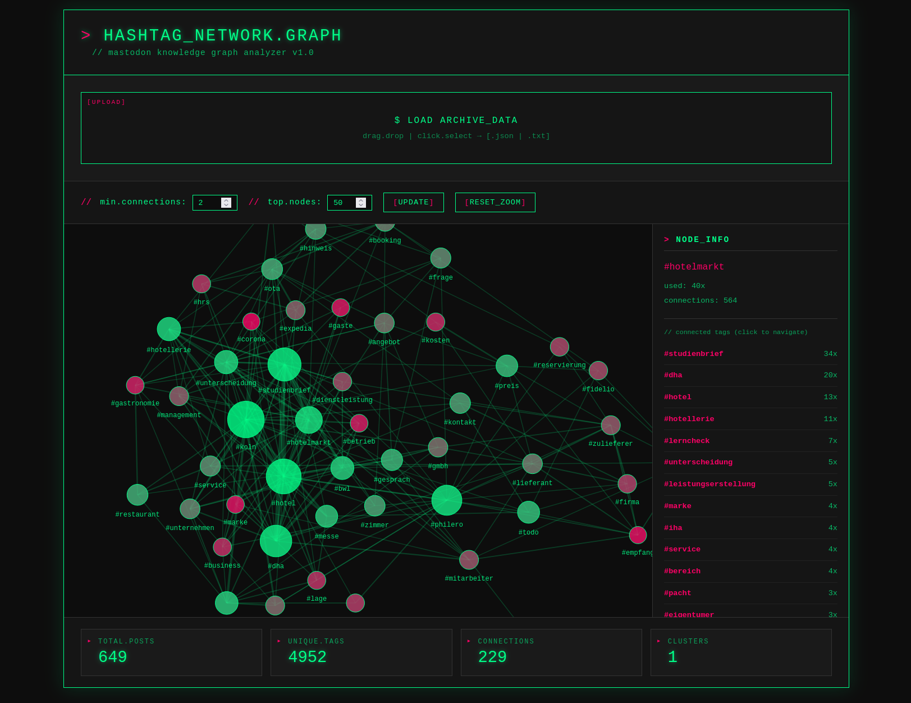

# Mastodon Hashtag Network Analyzer

Visualisiere die Verbindungen zwischen Hashtags in deinem Mastodon-Archiv als interaktiven Graph.



## Features

- 🔗 Interaktive Netzwerk-Visualisierung
- 🖱️ Navigation durch Klick auf Knoten oder Hashtags in der Sidebar
- 📊 Statistiken: Posts, Hashtags, Verbindungen, Cluster
- 💾 Lokale Verarbeitung - keine Datenübertragung

## Installation

1. `hashtag-graph.html` herunterladen
2. Im Browser öffnen
3. Mastodon-Archiv (outbox.json) per Drag & Drop ins Fenster ziehen

## Mastodon-Export

**Einstellungen** → **Import und Export** → **Datenexport** → **Posts** herunterladen

## Anpassung

CSS-Variablen für Farben:

```css
--cyber-green: #00ff88;  /* Hauptfarbe */
--cyber-pink: #ff0066;   /* Akzentfarbe */
```

Force-Simulation-Parameter in `createGraph()`:

```javascript
.force('charge', d3.forceManyBody().strength(-800))  // Abstoßung
.force('link', d3.forceLink(links).distance(150))    // Abstand
```

## Technologie

- D3.js v7.8.5 für Graph-Visualisierung
- Vanilla JavaScript
- Keine Server-Kommunikation

## Changelog

**2024-11-28 - v1.1**
- Verbesserte Label-Lesbarkeit mit Text-Halo-Effekt
- Fixierte Node-Positionen: Gezogene Knoten bleiben an Ort und Stelle
- Farbcodierung nach Häufigkeit mit Legende (Grün = häufig, Magenta = selten)
- RESET_POSITIONS Button zum Zurücksetzen der manuellen Anordnung
- Node-Filter nach Verbindungsanzahl (min/max connections)
- Filtert ungültige Hashtags (reine Zahlen, zu kurze Tags)
- Breiteres Layout (1600px) für bessere Übersicht
- Kompaktere Controls ohne Zeilenumbruch

## Lizenz

GPL-3.0

## Autor

Michael Karbacher
